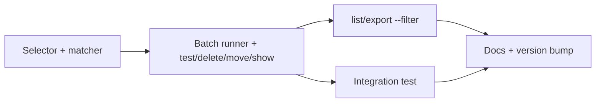
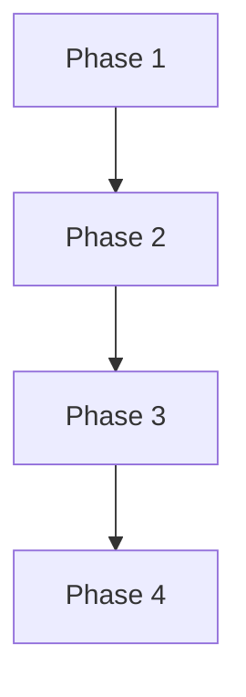

# Implementation Plan: Batch Selection With --all And --filter

## Overview

Add a shared selector (`--name` | `--filter` | `--all`) and a shared batch runner to `src/sqlcl_conn_mng/cli.py`, wire them into `test`, `show`, `delete` and `move`, add `--filter` to `list` and `export`, then document and bump the version.

## Affected Files

| File | Change Type | Description |
| ---- | ----------- | ----------- |
| src/sqlcl_conn_mng/cli.py | Update | Selector group, matcher, batch runner, handler changes, `--filter` on `list` and `export` |
| tests/test_cli.py | Update | Unit tests for every new path |
| tests/integration/test_batch_compat.py | Create | Real-SQLcl `move --filter` and `delete --filter --yes` |
| README.md | Update | Command table, examples, exit codes |
| .claude/skills/sqlcl-conn-mng/SKILL.md | Update | New parameters and batch commands |
| pyproject.toml | Update | Version `0.3.0` |
| uv.lock | Update | Regenerated by `uv lock` |

## Phase 1: Selector And Matcher

Requirements: REQ-1, REQ-2, REQ-3

### Implementation Work (Phase 1)

- Add `_add_selector(parser)` in `cli.py`: a required mutually exclusive group with `--name`, `--filter` and `--all` (`store_true`). Apply it to `test`, `show`, `delete` and `move` in place of `_add_name`.
- Add `_matches(name, pattern)` using `fnmatch.fnmatchcase`.
- Add `_select_names(args, store)`: `--name` checks existence and keeps the `No saved connection named` error; `--all` returns every name; `--filter` returns matches; result sorted.
- Extract the data-building part of `_cmd_show` into a per-connection helper so Phase 2 can reuse it.

### Test Work (Phase 1)

- `tests/test_cli.py`: usage error (exit 2) for zero and for two selectors on each of the four commands; glob matching with `*`, `?`, `[...]`; case sensitivity; sorted order; `--name` unknown still returns 1.

### Verification (Phase 1)

- `make unit PYTEST_ARGS=tests/test_cli.py` passes; `make check` clean.

## Phase 2: Batch Runner And Command Wiring

Requirements: REQ-4, REQ-5, REQ-6

### Implementation Work (Phase 2)

- Add `_run_batch(args, names, action)`: single `--name` calls `action` directly; a batch catches per-name `SqlclError`, `StoreError`, `ValueError`, `OSError`, prints `[OK] NAME` or `[FAIL] NAME: reason`, then `Summary: N ok, M failed`; exit 1 on any failure; empty selection raises `ValueError("No connections match ...")`.
- Rewrite `_cmd_test`, `_cmd_move` and `_cmd_delete` over `_run_batch`. `_cmd_delete` checks `--yes` first and prints the matched names before deleting.
- Rewrite `_cmd_show` for batch: JSON list or table blocks separated by a blank line; `--name` output unchanged.

### Test Work (Phase 2)

- `tests/test_cli.py`: `--name` output unchanged for all four; batch continues after a mocked failure and exits 1; empty match exits 1; `delete --all` without `--yes` calls nothing; with `--yes` lists names then deletes; `show --all` JSON and table; `move --filter` passes the folder to each.
- Create `tests/integration/test_batch_compat.py` following `tests/integration/test_connection_ops_compat.py`.

### Verification (Phase 2)

- `make unit`, `make check`, `make integration` pass.

## Phase 3: list And export Filter

Requirements: REQ-2, REQ-6

### Implementation Work (Phase 3)

- Add optional `--filter` to `list` (AND with `--folder`) and `export`; apply `_matches` to connection names.
- `export` message counts only exported connections.

### Test Work (Phase 3)

- `tests/test_cli.py`: `list --filter` table and JSON, with and without `--folder`; `export --filter` writes only matches; filter matching nothing prints an empty table and exports zero connections, exit 0.

### Verification (Phase 3)

- `make unit` and `make check` pass.

## Phase 4: Documentation And Version Bump

Requirements: REQ-7, REQ-8

### Implementation Work (Phase 4)

- `README.md`: add `--filter` and `--all` rows to the command table, a batch section (filter syntax, output format, exit codes), examples with quoted patterns, and an update to the exit-code table.
- `.claude/skills/sqlcl-conn-mng/SKILL.md`: add batch rows for test, show, move, delete.
- `pyproject.toml`: `version = "0.3.0"`; run `uv lock`.
- Reinstall: `uv tool install --from . sqlcl-conn-mng --reinstall`.

### Test Work (Phase 4)

- None beyond Phase 1 to 3; docs checked by the markdown linter.

### Verification (Phase 4)

- `sqlcl-conn-mng --version` prints `0.3.0`; `markdownlint-cli2` clean on the changed Markdown files.

## Traceability

| REQ | Phase | Acceptance Criteria |
| --- | ----- | ------------------- |
| REQ-1 | Phase 1 | AC-1, AC-4 |
| REQ-2 | Phase 1, Phase 3 | AC-3, AC-10 |
| REQ-3 | Phase 1 | AC-2, AC-3, AC-4 |
| REQ-4 | Phase 2 | AC-5, AC-6 |
| REQ-5 | Phase 2 | AC-7 |
| REQ-6 | Phase 2, Phase 3 | AC-8, AC-9, AC-10 |
| REQ-7 | Phase 4 | AC-11 |
| REQ-8 | Phase 4 | AC-12 |
| REQ-9 | Phase 1, Phase 2, Phase 3 | AC-2, AC-13 |

## Dependency Graph

## Estimated Scope

| Phase | Source Files | Test Files | Effort |
| ----- | ------------ | ---------- | ------ |
| Phase 1 | 1 | 1 | Small |
| Phase 2 | 1 | 2 | Medium |
| Phase 3 | 1 | 1 | Small |
| Phase 4 | 4 | 0 | Small |
