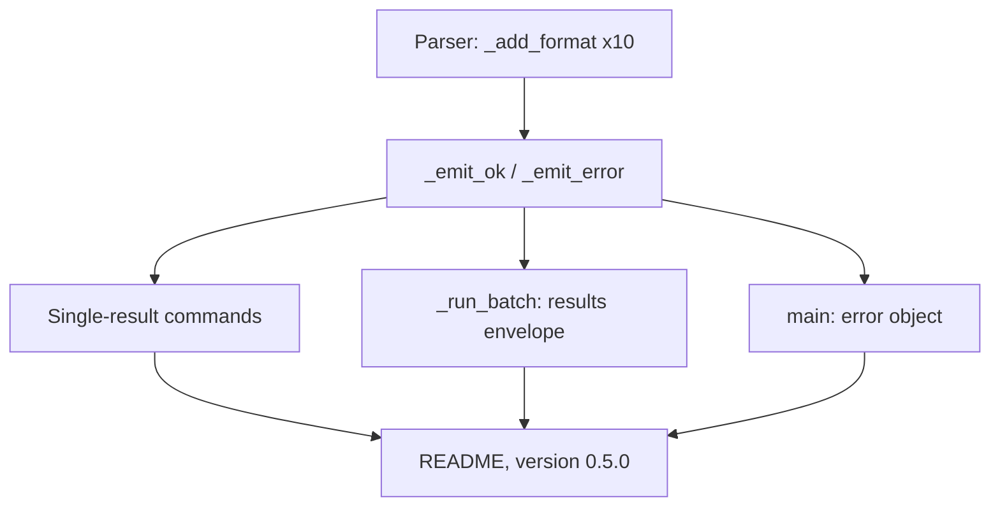
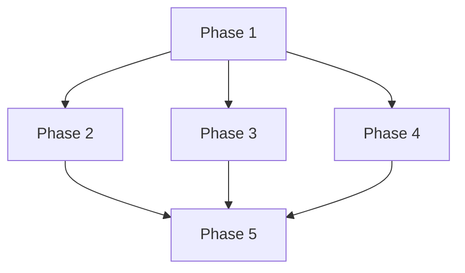

# Implementation Plan: JSON Output For All Commands

## Overview

Add `--format table|json` to ten commands and route their output through two emit helpers, so that json mode prints one document and table mode is unchanged.

## Affected Files

| File | Change Type | Description |
| ---- | ----------- | ----------- |
| src/sqlcl_conn_mng/cli.py | Update | Option on ten parsers, emit helpers, batch envelope, error object |
| tests/test_cli.py | Update | Unit tests for json and table paths |
| tests/integration/test_batch_compat.py | Update | One real-SQLcl json batch test |
| README.md | Update | Options table and envelope section |
| pyproject.toml | Update | Version 0.5.0 |
| uv.lock | Update | Refreshed by `uv lock` |

## Phase 1: Option And Emit Helpers

Requirements: REQ-1, REQ-2, REQ-6

### Implementation Work (Phase 1)

- Call `_add_format(p)` in `build_parser` for `add`, `update`, `delete`, `rename`, `move`, `clone`, `test`, `add-folder`, `delete-folder`, `export`.
- Add `_emit_ok(args, message, **fields)` next to `_dump`: table mode prints `message`, json mode dumps `{"status", "command", "message", **fields}` and drops `None` fields.
- Add `_emit_error(args, message)`: prints the error object only when `getattr(args, "format", "table") == "json"`.

### Test Work (Phase 1)

- Parser tests: each of the ten accepts `table` and `json`, default `table`, exits 2 on another value.
- `_emit_ok` unit tests for both modes and the `None` field drop.

### Verification (Phase 1)

- `uv run pytest tests/test_cli.py -q` passes; existing tests unchanged.

## Phase 2: Single-Result Commands

Requirements: REQ-3, REQ-6

### Implementation Work (Phase 2)

- Replace the `print(...)` in `_cmd_add`, `_cmd_update`, `_cmd_rename`, `_cmd_clone`, `_cmd_add_folder`, `_cmd_delete_folder`, `_cmd_export` with `_emit_ok` and the fields of the REQ-3 table.
- `_cmd_add`: table mode keeps its two printed lines; json mode prints one object with `name` and `folder`.
- `_run_batch` `--name` branch calls `_emit_ok(args, action(names[0]), name=names[0])`; `move` adds `folder`.

### Test Work (Phase 2)

- Per command: json stdout parses and holds `status`, `command`, `message` and the extra fields; table stdout equals the old text.

### Verification (Phase 2)

- `uv run pytest tests/test_cli.py -q` passes.

## Phase 3: Batch Envelope

Requirements: REQ-4, REQ-6

### Implementation Work (Phase 3)

- In `_run_batch`, for `--filter` / `--all` in json mode collect `{"name", "status", "message"}` per item, print nothing per item, then dump `{"status", "command", "results", "ok", "failed"}`; table mode keeps `[OK]` / `[FAIL]` and `Summary:`.
- `_cmd_delete` prints `Deleting N connection(s): ...` only in table mode.

### Test Work (Phase 3)

- Batch json with all ok, with one failing item (exit 1, `status` error, other items still run), and with an empty match (goes to Phase 4 error object).
- `delete --filter ... --yes --format json` stdout is one parseable document.
- Integration test: `move --filter ... --format json` against real SQLcl in `tests/integration/test_batch_compat.py`.

### Verification (Phase 3)

- `uv run pytest tests/test_cli.py -q` passes; `make integration` passes where SQLcl is available.

## Phase 4: Error Object

Requirements: REQ-5, REQ-6

### Implementation Work (Phase 4)

- In `main`, after `logger.error(...)` in both `except` branches, call `_emit_error(args, str(exc))` (message `Interrupted` for the keyboard interrupt).

### Test Work (Phase 4)

- For each caught exception type and for the empty match, json mode prints the error object, stderr keeps the log line, exit code is 1.
- `list`, `show`, `folders` failures print the error object in json mode.
- A usage error stays plain text, exit 2.

### Verification (Phase 4)

- `uv run pytest tests/test_cli.py -q` passes.

## Phase 5: Documentation, Version And Final Checks

Requirements: REQ-7, REQ-8

### Implementation Work (Phase 5)

- README: add `--format` rows for the ten commands and a section with the three envelopes and an example.
- `pyproject.toml` version `0.5.0`, then `uv lock`.
- `uv tool install --from . sqlcl-conn-mng --reinstall` if a global copy exists; confirm `sqlcl-conn-mng --version` prints `0.5.0`.

### Test Work (Phase 5)

- Run the whole suite and the lint gate.

### Verification (Phase 5)

- `make check` and `make unit` clean; `make integration` where SQLcl is available.

## Traceability

| REQ | Phase | Acceptance Criteria |
| --- | ----- | ------------------- |
| REQ-1 | Phase 1 | AC-1 |
| REQ-2 | Phase 1, Phase 2 | AC-2 |
| REQ-3 | Phase 2 | AC-3 |
| REQ-4 | Phase 3 | AC-4 |
| REQ-5 | Phase 4 | AC-5 |
| REQ-6 | Phase 1, Phase 2, Phase 3, Phase 4 | AC-6 |
| REQ-7 | Phase 1, Phase 2, Phase 3, Phase 4, Phase 5 | AC-7 |
| REQ-8 | Phase 5 | AC-8 |

## Dependency Graph

Phases 2, 3 and 4 depend only on Phase 1 and can run in parallel.

## Estimated Scope

| Phase | Source Files | Test Files | Effort |
| ----- | ------------ | ---------- | ------ |
| Phase 1 | 1 | 1 | Small |
| Phase 2 | 1 | 1 | Medium |
| Phase 3 | 1 | 2 | Medium |
| Phase 4 | 1 | 1 | Small |
| Phase 5 | 3 | 0 | Small |
