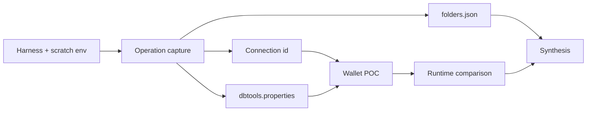
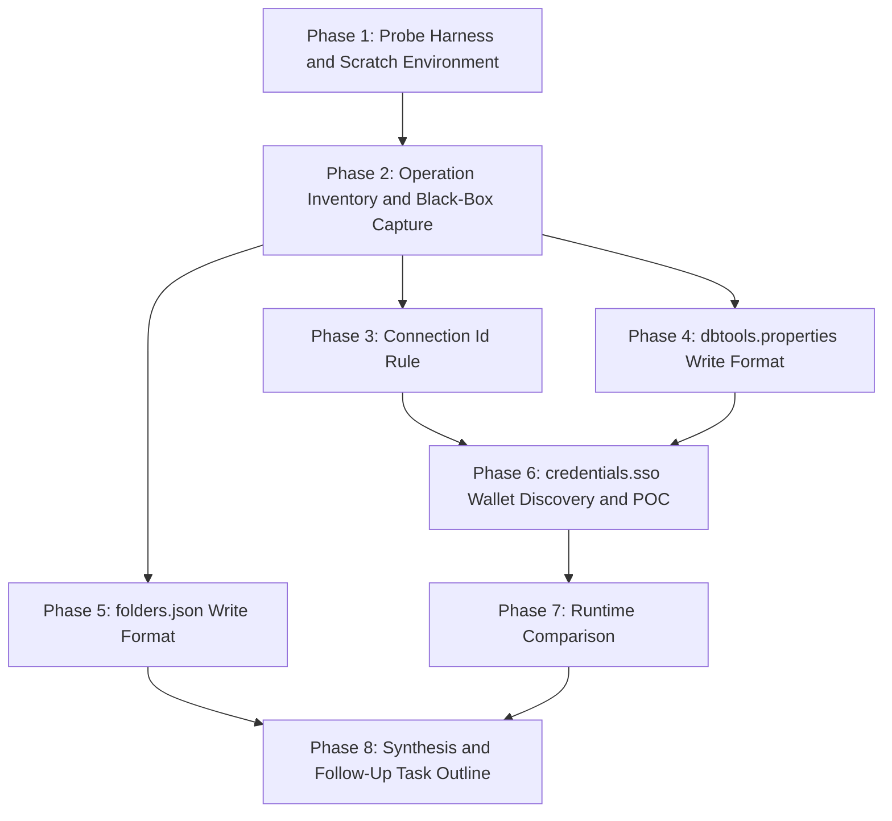

# Implementation Plan: Investigate SQLcl Store Writes for SQLcl-Free Catalog Management

## Overview

The investigation builds a safe probe harness first, captures what every store-writing SQLcl operation does, then works through each store artifact - connection id, `dbtools.properties`, `folders.json` - in parallel, proving each claim by round trip. The wallet follows as a discovery-plus-POC phase with a feasibility exit, then the runtime comparison, and finally a synthesis that writes the follow-up implementation task outline. Method throughout is clean-room (`open_questions.md`, Q1): black-box store diffs plus `javap` signatures and constants, all raw material kept in `<scratch-root>`.

## Affected Files

| File | Change Type | Description |
| ---- | ----------- | ----------- |
| `scripts/store_probe.py` | Create | Stdlib-only snapshot and diff harness for a store root |
| `tests/test_store_probe.py` | Create | Unit tests for the harness, including the no-secret-output property |
| `docs/tasks/sqlcl_jar_store_investigation/findings.md` | Create | The specification; one section per phase |
| `docs/tasks/sqlcl_jar_store_investigation/open_questions.md` | Update | Q1 escalation outcome, only if Phase 6 needs decompilation |
| `docs/tasks/sqlcl_jar_store_investigation/progress.md` | Update | Checklist progress |

## Phase 1: Probe Harness and Scratch Environment

Requirements: REQ-1, REQ-9

### Implementation Work (Phase 1)

- Create `scripts/store_probe.py` with `argparse` subcommands selected by `--command` (`snapshot`, `diff`) and named options only: `--home`, `--output`, `--before`, `--after`.
- `snapshot`: walk the store root; for each file record relative path, size and the first 12 hex digits of its SHA-256. Parse `dbtools.properties` with `sqlcl_conn_mng.properties.parse_properties` and `folders.json` with `json`, and store the parsed content. For `credentials.sso`, any other non-text file, and any properties key whose name contains `password` or `pwd` (case-insensitive), store size and hash prefix only.
- `diff`: report files added, removed and changed; for properties files the keys added, removed and changed; for `folders.json` the folders and connection ids added, removed and moved.
- Write the module docstring stating the safety property and the scratch-only rule.
- Create the scratch environment (not committed): `<scratch-root>/stores/`, `<scratch-root>/snapshots/`, `<scratch-root>/javap/`.
- Start a podman Oracle container with the `db-tool` skill and create a dummy schema whose password exists only in a shell variable read from a scratch file; record the connect string in `findings.md`, never the password.
- Dump `javap -p` signatures and constant-pool strings for the classes named in `analysis.md` into `<scratch-root>/javap/`.
- Start `findings.md` with an environment section: SQLcl version, JRE SQLcl ran on, OS, evidence-tag legend.

### Test Work (Phase 1)

- `tests/test_store_probe.py`: build a fake store in `tmp_path` (connection dir with `dbtools.properties` and a `credentials.sso` holding a planted marker byte string; a `folders.json` with a nested folder).
- Assert `snapshot` records the expected files, sizes and parsed keys.
- Assert `diff` reports an added connection, a changed key and a moved connection id.
- Assert the planted wallet marker and a planted `password=` value appear nowhere in captured stdout, stderr or the snapshot file.

### Verification (Phase 1)

- `uv run pytest -q tests/test_store_probe.py` passes.
- `uv run ruff check src tests scripts` and `uv run ruff format --check src tests scripts` are clean.
- `uv run mypy scripts/store_probe.py` is clean.
- `uv run python scripts/store_probe.py --command snapshot --home <scratch-root>/stores/empty --output <scratch-root>/snapshots/empty.json` succeeds on an empty store.

## Phase 2: Operation Inventory and Black-Box Capture

Requirements: REQ-5

### Implementation Work (Phase 2)

- List every `connmgr` subcommand and flag from `help connmgr` and from the `ConnectionStoreOptions` signatures in `<scratch-root>/javap/`; mark which ones write the store.
- For each store-writing operation, in a fresh scratch store: snapshot, run the operation through `MSYS_NO_PATHCONV=1 sql -S -nohistory -noupdates -thin -home <store> /nolog` with the script on stdin, snapshot again, and diff. Cover at least: `connect -save` (with and without `-savepwd`, with `-replace` over an existing name), `connmgr add -folder` (top-level and nested), `connmgr delete -conn`, `connmgr rename -conn`, `connmgr move -conn`, `connmgr clone` (plain, `-username`, `-nopwd`), `connmgr delete -folder` (empty, non-empty without `-force`, with `-force`), and any further writing subcommand the inventory finds.
- For each operation, record the validation SQLcl applies: duplicate name (same case and different case), missing folder, names with spaces and non-ASCII characters, and the exact success and failure output.
- Check atomicity: look for temporary or lock files during writes, and whether two SQLcl processes writing `folders.json` at once lose an update.
- Write the "Operation effect map" section of `findings.md`, one table row per operation, each citing its snapshot pair.

### Test Work (Phase 2)

- None automated; each table row cites the snapshot pair in `<scratch-root>/snapshots/` that proves it, and the exact command sequence is written in `findings.md` so it can be re-run.

### Verification (Phase 2)

- Every writing subcommand from the inventory has a row in `findings.md`, and every row cites a diff.
- `uv run sqlcl-conn-mng list --home <scratch-root>/stores/<store>` agrees with `connmgr list` for every store left after the captures.

## Phase 3: Connection Id Rule

Requirements: REQ-2

### Implementation Work (Phase 3)

- Collect the ids produced across Phase 2; decode each as URL-safe Base64 without padding and check length, UUID version and variant bits.
- Check `javap` constants and signatures for UUID or Base64 use in `ConnectionStorage`.
- From the Phase 2 diffs, record whether `rename`, `move` and `clone` keep or change the id.
- Round trip: copy a SQLcl-written connection into a new directory named with an id generated in Python by the inferred rule, add the id to `folders.json` where relevant, and confirm `connmgr list` and `connmgr show` see it. Repeat with an id that breaks the rule (wrong length, wrong alphabet) and record how SQLcl reacts.
- Write the "Connection id" section of `findings.md`.

### Test Work (Phase 3)

- None automated; the round-trip commands and outcomes are recorded in `findings.md`.

### Verification (Phase 3)

- The rule in `findings.md` names its evidence tags, and the round trip is recorded as `[round-trip]`.

## Phase 4: dbtools.properties Write Format

Requirements: REQ-3

### Implementation Work (Phase 4)

- From the Phase 2 snapshots, record the key set per operation and option, key order, header comment and date line, line endings, trailing newline and encoding.
- Save connections whose name, user and connect string contain `:`, `=`, `\`, `#`, `!`, spaces, leading spaces and non-ASCII characters; record the escaping SQLcl writes.
- Check `javap` output for `Properties.store` or a custom writer, and record the JRE in use.
- Round trip: write a `dbtools.properties` from a Python prototype in `<scratch-root>` (not committed), place it in a connection directory with a SQLcl-written wallet, and confirm `connmgr show` and `connmgr list` show identical values. Byte-compare against the SQLcl-written file for the same input; list each difference and why it is harmless.
- Check SQLcl tolerance: missing header, reordered keys, LF versus CRLF, an unknown extra key.
- Write the "dbtools.properties" section of `findings.md`.

### Test Work (Phase 4)

- None automated; the prototype stays in `<scratch-root>` and its outcomes are recorded as `[round-trip]`.

### Verification (Phase 4)

- `connmgr show` output for the Python-written file matches the SQLcl-written one field for field.

## Phase 5: folders.json Write Format

Requirements: REQ-4

### Implementation Work (Phase 5)

- From the Phase 2 snapshots, record the top-level shape, folder keys, ordering of folders and ids, indentation, encoding and trailing newline, and what SQLcl writes when the file is absent.
- Probe tolerance: a dangling id (no connection directory), an id listed in two folders, an empty `connections` array versus a missing key, unknown extra keys, compact versus indented JSON.
- Check `javap` signatures of the folder serialization classes for the serializer used.
- Round trip: write a `folders.json` with nested folders from a Python prototype in `<scratch-root>`; confirm `connmgr list` and `uv run sqlcl-conn-mng folders --home <store>` show the same tree. Byte-compare as in Phase 4.
- Write the "folders.json" section of `findings.md`.

### Test Work (Phase 5)

- None automated; outcomes recorded as `[round-trip]`.

### Verification (Phase 5)

- The tree shown by `connmgr list` and by `sqlcl-conn-mng folders` matches the Python-written file.

## Phase 6: credentials.sso Wallet Discovery and POC

Requirements: REQ-6

Its outcome decides how Phase 7 is run. It contains a **non-shippable POC**: all wallet code stays in `<scratch-root>/poc/` and is removed in Phase 8.

### Implementation Work (Phase 6)

- From the Phase 2 snapshots, compare wallets: two empty wallets from separate saves, a wallet with a saved dummy password, the same after `clone -nopwd`, and after `connect -save` without `-savepwd`. Record sizes and whether hashes match, using the harness only.
- From `javap` constants of `WalletUtils`, `OracleSecretStore`, `OracleSecretStoreConstants` and `OracleFileSSOWalletImpl`, record secret alias names, algorithm names and file-format constants.
- Build a structure analyser in `<scratch-root>/poc/` that prints offsets, lengths and structure names of a wallet - never content bytes - and use it with public descriptions of the `cwallet.sso` layout to map the file.
- POC: write an empty wallet and a wallet holding the dummy password from Python; confirm SQLcl accepts each (`connmgr show` reports the expected password state; `connect` by saved name succeeds with the dummy password).
- Escalation gate: if the layout cannot be mapped under the clean-room method, stop and ask the user whether local decompilation is allowed (`open_questions.md`, Q1); record the answer there before continuing.
- Exit criterion: either both POC wallets are accepted by SQLcl, or the blocker is named with its evidence. Write the "credentials.sso" section of `findings.md` with the verdict.

### Test Work (Phase 6)

- None automated; the POC is non-shippable. Outcomes recorded as `[round-trip]` or as a named blocker.

### Verification (Phase 6)

- Before any analyser run on a wallet, predict its output and confirm it contains no content bytes (`~/.claude/rules/secrets.md`).
- The verdict line in `findings.md` is one of: accepted, blocked (with blocker named).

## Phase 7: Runtime Comparison

Requirements: REQ-7

Conditional on Phase 6: if the pure-Python wallet POC was accepted, the JRE option is costed as a fallback only; if it was blocked, the JRE option is costed as the primary path and checked hands-on.

### Implementation Work (Phase 7)

- Pure Python: list the libraries the Phase 6 POC needed (stdlib, `cryptography` or other), their licences, and platform caveats.
- Python + JRE: identify the Maven Central coordinates of `oraclepki` and its dependencies, their licence, download size, and the minimal call sequence for create-wallet, add-secret, read-secret-presence and copy-secret. If Phase 6 was blocked, prove that sequence in `<scratch-root>/poc/` against a scratch store.
- Fill a comparison table: dependencies, licences, footprint, Windows/Linux/macOS behaviour, operations covered. End with one recommendation.
- Write the "Runtime comparison" section of `findings.md`.

### Test Work (Phase 7)

- None automated.

### Verification (Phase 7)

- The comparison table has both runtimes and every column filled, and ends with one recommendation.

## Phase 8: Synthesis and Follow-Up Task Outline

Requirements: REQ-8, REQ-9

### Implementation Work (Phase 8)

- Review `findings.md` end to end: every claim carries an evidence tag; contradictions between phases are resolved by re-running the cited probe.
- Add the "Follow-up" section: a table of every `sqlcl-conn-mng` command (`list`, `show`, `show --check-password`, `folders`, `add`, `delete`, `rename`, `move`, `clone`, `test`, `add-folder`, `delete-folder`, `export`) with a verdict - feasible without SQLcl, feasible with the fallback runtime, or still needs SQLcl - and the follow-up implementation task(s) to create, plus the deferred items: connectivity via python-oracledb, cross-version checks, `README.md` "Store format" update.
- Remove the non-shippable POC: delete `<scratch-root>/poc/`, `<scratch-root>/javap/` and the scratch stores holding wallets.
- Stop the podman Oracle container if this task started it.
- Run the hygiene checks of AC-9.

### Test Work (Phase 8)

- Re-run the full suite to confirm nothing outside the harness changed.

### Verification (Phase 8)

- `git ls-files | grep -E '\.(jar|class|java|sso)$'` prints nothing, and no snapshot JSON is tracked.
- With the dummy password read into `PW` from its scratch file: `[ -n "$PW" ] && git grep -IlF --untracked -e "$PW"` prints nothing.
- `uv run pytest -q` passes; `uv run ruff check src tests scripts` is clean; `markdownlint-cli2 "docs/**/*.md"` from `<repo-root>` is clean.

## Traceability

| REQ | Phase | Acceptance Criteria |
| --- | ----- | ------------------- |
| REQ-1 | Phase 1 | AC-1 |
| REQ-2 | Phase 3 | AC-2 |
| REQ-3 | Phase 4 | AC-3 |
| REQ-4 | Phase 5 | AC-4 |
| REQ-5 | Phase 2 | AC-5 |
| REQ-6 | Phase 6 | AC-6 |
| REQ-7 | Phase 7 | AC-7 |
| REQ-8 | Phase 8 | AC-8 |
| REQ-9 | Phase 1, Phase 8 | AC-1, AC-9 |

## Dependency Graph

Phases 3, 4 and 5 can run in parallel. Phase 6 needs Phases 3 and 4 because the wallet round trip places a Python-written wallet beside a valid id and properties file.

## Estimated Scope

| Phase | Source Files | Test Files | Effort |
| ----- | ------------ | ---------- | ------ |
| Phase 1: Probe Harness and Scratch Environment | 1 | 1 | Medium |
| Phase 2: Operation Inventory and Black-Box Capture | 0 | 0 | Medium |
| Phase 3: Connection Id Rule | 0 | 0 | Small |
| Phase 4: dbtools.properties Write Format | 0 | 0 | Small |
| Phase 5: folders.json Write Format | 0 | 0 | Small |
| Phase 6: credentials.sso Wallet Discovery and POC | 0 | 0 | Large |
| Phase 7: Runtime Comparison | 0 | 0 | Medium |
| Phase 8: Synthesis and Follow-Up Task Outline | 0 | 0 | Small |
