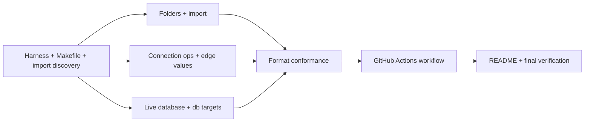
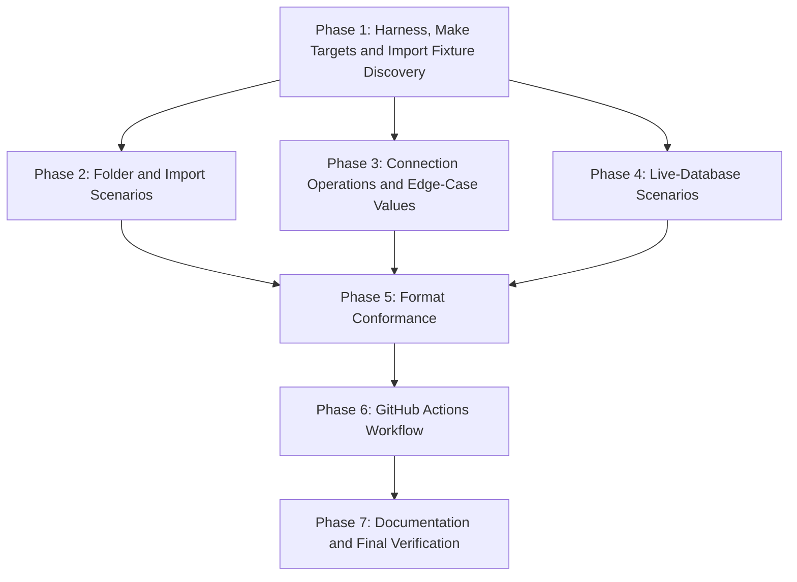

# Implementation Plan: Integration Tests for Compatibility with SQLcl-Made Store Entries

## Overview

Build a `tests/integration/` package around one harness: find SQLcl, build each scenario store with one SQLcl process, snapshot it, and run the tool's CLI in-process against it. A root `Makefile` becomes the single entry point for checks, tests, the SQLcl download and the test database. Scenario modules then cover folders and import (database-free), connection operations and edge-case values (database-free where possible), saved passwords (live database), and format conformance with `findings.md`. A GitHub Actions workflow calls the same `make` targets on Ubuntu and Windows, and the last phase documents the targets and runs the final checks. No file under `src/` changes.

## Affected Files

| File | Change Type | Description |
| ---- | ----------- | ----------- |
| `Makefile` | Create | Single entry point: `check`, `unit`, `integration`, `sqlcl`, `print-sqlcl-version`, `print-sqlcl-dir`, `print-sqlcl-bin`, `db-start`, `db-stop` |
| `.gitignore` | Update | Ignore `.cache/` (SQLcl download) |
| `.github/workflows/ci.yml` | Create | Ubuntu and Windows matrix calling `make` targets |
| `tests/integration/__init__.py` | Create | Package marker |
| `tests/integration/conftest.py` | Create | SQLcl discovery, release, store builder, CLI runner, snapshots, database settings, password guard |
| `tests/integration/data/sqldev_export.json` | Create | SQL Developer export accepted by `connmgr import` (fake values) |
| `tests/integration/test_harness_smoke.py` | Create | Harness self-checks and skip behaviour |
| `tests/integration/test_folders_compat.py` | Create | REQ-2 scenarios |
| `tests/integration/test_import_compat.py` | Create | REQ-3 scenarios |
| `tests/integration/test_connection_ops_compat.py` | Create | REQ-4 scenarios |
| `tests/integration/test_edge_values_compat.py` | Create | REQ-5 scenarios |
| `tests/integration/test_saved_password_compat.py` | Create | REQ-6 scenarios |
| `tests/integration/test_format_conformance.py` | Create | REQ-7 assertions |
| `README.md` | Update | "Development" and "Testing": `make` targets, `SQLCL_ITEST_*`, database targets, workflow, `sql.exe` note |
| `docs/tasks/sqlcl_store_compat_tests/progress.md` | Update | Checklist and follow-up notes |
| `docs/tasks/sqlcl_store_compat_tests/open_questions.md` | Update | Q11 outcome |

## Phase 1: Harness, Make Targets and Import Fixture Discovery

Requirements: REQ-1, REQ-8, REQ-10

### Implementation Work (Phase 1)

- Create the root `Makefile` with `SHELL := bash`, `.PHONY` targets and these variables defined once: `SQLCL_VERSION ?= 25.4.1.022.0618`, `SQLCL_URL`, `SQLCL_DIR := .cache/sqlcl`, `PYTEST_ARGS ?=`. Targets: `check` (`uv run ruff check src tests scripts`, `uv run ruff format --check src tests scripts`, `uv run mypy`), `unit` (`uv run pytest -q $(PYTEST_ARGS)`), `integration` (`uv run pytest -m integration -q -rs $(PYTEST_ARGS)`), `sqlcl` (download with `curl -fsSL` and unpack with `uv run python -m zipfile -e` into `$(SQLCL_DIR)/$(SQLCL_VERSION)`, skipped when present), `print-sqlcl-version`, and `print-sqlcl-dir` / `print-sqlcl-bin`, which print the absolute cache directory and the unpacked `bin` directory so the workflow reads them instead of repeating them (`notes.md`, D3).
- Add `.cache/` to `.gitignore`.
- Create `tests/integration/__init__.py` and `tests/integration/conftest.py`. Apply `pytest.mark.integration` to every test in the package through `pytestmark` in each module.
- Session fixture `sqlcl_path`: `shutil.which(os.environ.get("SQLCL_BIN") or "sql")`; `pytest.skip` with "SQLcl not found: set SQLCL_BIN to sql.exe or put sql on PATH" when `None`.
- Session fixture `sqlcl_release`: read the `RELEASE=` line of `version.txt` in the directory of `sqlcl_path`; `unknown` when absent.
- Fixture factory `build_store(stages)`: create a store under `tmp_path_factory`; each stage is a list of `(command, expected_line)` steps run in one `SqlclRunner.run` call with `-home <store>` and followed by a snapshot, so a test can compare the states around a measured operation. Fail unless the expected lines occur in order. Failure messages carry the stage and step number and the cleaned output with the database password masked; never the script.
- Fixture `run_cli(store, *args)`: call `sqlcl_conn_mng.cli.main` with `--home <store>`, plus `--sqlcl <sqlcl_path>` for commands that run SQLcl; capture stdout and stderr with `contextlib` redirection and the `sqlcl_conn_mng` log records with a temporary handler, because the CLI reports errors through `logging` and `capsys` sees none of them (`notes.md`, D2); return exit code, stdout, stderr plus log text, and decoded JSON when `--format json` was passed. Usable from any fixture scope.
- Helper `snapshot(store)`: load `scripts/store_probe.py` with `importlib.util.spec_from_file_location` and return `take_snapshot(store)` with the `sqlcl/` subtree removed.
- Helper `copy_store(store, tmp_path)` for tests that write.
- Session fixture `db_settings`: read `SQLCL_ITEST_CONNECT`, `SQLCL_ITEST_USER`, `SQLCL_ITEST_PASSWORD`; `pytest.skip` naming the missing variable names (never values).
- Helper `assert_no_password(*texts)`: fail with "database password found in tool output" and never print the password or the text.
- Discovery (`open_questions.md`, Q11): write `tests/integration/data/sqldev_export.json` with three connections `imp1`, `imp2`, `imp3` using fake host `db.example.test`, port `1521`, service `fakesvc` and users `imp_user1` to `imp_user3`, no password. Run `connmgr import` against a scratch store and record the accepted shape, or the rejection output, in `open_questions.md`, Q11.

### Test Work (Phase 1)

- `tests/integration/test_harness_smoke.py`: the release is not `unknown`; `build_store` adds folder `/smoke` and `run_cli` reports it in `folders --format json`; `snapshot` reports `connection_folders/folders.json` and no `sqlcl/` path; `build_store` with a wrong expected line fails with the step number; importing the fixture creates three connections of type `ORACLE_BASIC`.

### Verification (Phase 1)

- `make check` and `make unit` - clean, and the unit count matches the baseline with no integration test selected.
- `make sqlcl` twice - the first run downloads and unpacks, the second does nothing.
- `make integration PYTEST_ARGS=tests/integration/test_harness_smoke.py` - all pass.
- `SQLCL_BIN=/nonexistent/sql.exe PATH="$(printf %s "$PATH" | tr ':' '\n' | grep -vi sqlcl | paste -sd: -)" make integration PYTEST_ARGS=tests/integration` - every test skipped, none failed.
- Exit criterion for the discovery: `open_questions.md`, Q11 records an accepted export, or the rejection output and the fallback taken.

## Phase 2: Folder and Import Scenarios

Requirements: REQ-2, REQ-3

Conditional on Phase 1 discovery: the import scenarios and the imported connections used by `move -conn` exist only if SQLcl accepted the fixture. If it did not, REQ-3 moves to Non-Requirements (fallback in `open_questions.md`, Q11) and the `move -conn` cases run in Phase 4 with database-saved connections.

### Implementation Work (Phase 2)

- `test_folders_compat.py`, module store built by SQLcl: import the fixture; `add -folder /team/a/b` (missing parents), `/ops`, `/empty`; `move -conn imp1 /team/a/b`, `move -conn imp2 /ops`, `move -conn imp3 /ops`, `move -conn imp3 /`; `rename -folder /ops ops2`; `move -folder /team/a/b /empty`.
- A second module store for deletes: `delete -folder` of an empty folder, `delete -folder /x -force` with a connection inside, and deletion of the last folder.
- `test_import_compat.py`, module store: import the fixture, then import it again with `-duplicates RENAME` and with `-duplicates REPLACE`.

### Test Work (Phase 2)

- `folders --format json` equals the expected tree, including ids moved into renamed and moved folders.
- `list --folder <path> --format json` returns exactly the expected names for each folder, subfolders included.
- `move -conn imp3 /` puts `imp3` back at `/`; `root_connections` reports it and no folder lists it.
- After the forced delete the connection inside is gone from `list`; after the last folder is deleted `folders` reports `[]`.
- Tool commands on a copy of the SQLcl-built store: `add-folder`, `move`, `delete-folder`, `delete-folder --force --yes`; the tool's view matches the expected tree after each.
- Import: `list --format json` reports type `ORACLE_BASIC`, `name`, `user_name`, and `host`, `port`, `serviceName` in `extra` for each connection; `RENAME` adds `imp1_1`; `REPLACE` leaves two `imp1` entries with different ids; `show --name imp1_1 --check-password --format json` reports `wallet_present` true and `password_saved` false; `export` contains every imported value.
- Record in `progress.md` the follow-up "present the connect string of `ORACLE_BASIC` connections" (`open_questions.md`, Q6).

### Verification (Phase 2)

- `make integration PYTEST_ARGS="tests/integration/test_folders_compat.py tests/integration/test_import_compat.py"` - all pass.

## Phase 3: Connection Operations and Edge-Case Values

Requirements: REQ-4, REQ-5

Conditional on Phase 1 discovery: the source connections are imported and then cloned to new names, which needs no database. If the fixture was rejected, these scenarios run in Phase 4 from database-saved connections instead.

### Implementation Work (Phase 3)

- `test_connection_ops_compat.py`, module store built by SQLcl: import, then `clone -original imp1 c_plain`, `clone -original imp1 -username other_user c_user`, `clone -original imp1 -nopwd c_nopwd`, `add -folder /f`, `move -conn imp2 /f`, `clone -original imp2 c_from_folder`, `rename -conn c_plain c_renamed`, `clone -original imp1 c1`, `clone -original imp1 C1`, `clone -original imp1 c_doomed`, `delete -conn c_doomed`. Put the rename, move and delete steps in their own stages so ids can be compared.
- `test_edge_values_compat.py`, module store built by SQLcl: clone `imp1` to names with a leading space, inner spaces, each accepted special character from REQ-5, `café1` and `über1`; `clone -username "u:s=e#r!\x y"`; folders `/back\slash`, `/lt<gt>`, `/dev` and `/DEV`.

### Test Work (Phase 3)

- Ids: `c_renamed` has the id `c_plain` had; `imp2` keeps its id after the move; every clone has a new id; `c_from_folder` is at `/`; `c_doomed` is gone from `list` and from every folder.
- `c_user` reports `user_name` `other_user`.
- `show --name c1` and `show --name C1` return different ids.
- Tool commands on a copy of the store: `rename`, `move`, `clone`, `clone --user`, `clone --no-password`, `delete --yes` give the same id behaviour as the SQLcl-made equivalents.
- Every edge-case name and the special user are reported exactly by `list --format json` and `show --format json`; every edge-case folder is reported exactly by `folders --format json`.
- Non-ASCII names created through the tool's own `clone --new-name café2`: if SQLcl stores a different name on Windows, commit the test as `xfail(condition=sys.platform == "win32", strict=True, reason="sqlcl_stdin_encoding: SQLcl decodes stdin as cp1252 on Windows")`.

### Verification (Phase 3)

- `make integration PYTEST_ARGS="tests/integration/test_connection_ops_compat.py tests/integration/test_edge_values_compat.py"` - all pass, or strict `xfail` with a follow-up reason on Windows only.

## Phase 4: Live-Database Scenarios

Requirements: REQ-6, REQ-8, REQ-10

### Implementation Work (Phase 4)

- `Makefile`: add `ENGINE ?= podman`, `DB_IMAGE := gvenzl/oracle-xe:21-slim`, `DB_CONTAINER := sqlcl-itest-xe`, `DB_PORT ?= 1521`, the exported defaults `SQLCL_ITEST_USER ?= itest` and `SQLCL_ITEST_CONNECT ?= //localhost:$(DB_PORT)/XEPDB1`, and the targets `db-start` and `db-stop`. `db-start` fails with "SQLCL_ITEST_PASSWORD is not set" when the variable is empty; runs the container with `APP_USER="$$SQLCL_ITEST_USER" APP_USER_PASSWORD="$$SQLCL_ITEST_PASSWORD" ORACLE_PASSWORD="<random from python secrets>" $(ENGINE) run -d -e APP_USER -e APP_USER_PASSWORD -e ORACLE_PASSWORD ...`, so no recipe echo shows a password; then polls `$(ENGINE) exec $(DB_CONTAINER) healthcheck.sh` a bounded number of times and fails with the container log tail. `db-stop` removes the container and ignores a missing one.
- `test_saved_password_compat.py`, module store built by SQLcl with `db_settings`: `connect -save p_saved -savepwd`, `connect -save p_nopwd`, `connect -save p_replace -savepwd` then `-replace` without `-savepwd` then `-replace -savepwd` (each in its own stage), `clone -original p_saved p_clone`, `clone -original p_saved -username other_user p_clone_user`, `clone -original p_saved -nopwd p_clone_nopwd`, and `connect -save p_desc -savepwd` with the descriptor form of `SQLCL_ITEST_CONNECT`.
- The descriptor connect string is derived from `SQLCL_ITEST_CONNECT` (`//host:port/service`) as `(DESCRIPTION=(ADDRESS=(PROTOCOL=TCP)(HOST=host)(PORT=port))(CONNECT_DATA=(SERVICE_NAME=service)))`.

### Test Work (Phase 4)

- `list` and `show --format json` report name, `connect_string`, `user_name` and folder `/` for `p_saved` and `p_nopwd`.
- `show --check-password --format json`: `password_saved` true for `p_saved`, `p_clone`, `p_desc`; false for `p_nopwd`, `p_clone_user`, `p_clone_nopwd`; SQLcl's `connmgr show` agrees for each.
- `p_replace` keeps one id across both replaces, and its saved-password state follows the replace flags.
- `p_desc` reports the exact descriptor string.
- The tool's `test --name p_saved` exits 0.
- `assert_no_password` over the stdout and stderr of every tool call in the module and over an `export` file of the store.

### Verification (Phase 4)

- `env -u SQLCL_ITEST_PASSWORD make db-start` - fails with the variable named.
- With the three variables set: `make db-start`, `make integration PYTEST_ARGS=tests/integration/test_saved_password_compat.py`, `make db-stop` - the database starts, all tests pass, the container is removed; the make output shows `APP_USER_PASSWORD` as a name only.
- Without `SQLCL_ITEST_PASSWORD`: `make integration PYTEST_ARGS=tests/integration/test_saved_password_compat.py` - all skipped with the missing variable named.

## Phase 5: Format Conformance

Requirements: REQ-7

### Implementation Work (Phase 5)

- `test_format_conformance.py` reuses the stores and snapshots from Phases 2-4, whose fixtures are session-scoped in `tests/integration/conftest.py` from Phase 2 on, so no store is built twice (`notes.md`, D4).
- Helper `assert_format(condition, what, release)` that fails with `SQLcl <release> format drift: <what> differs from findings.md`.

### Test Work (Phase 5)

- Every connection directory name is 22 URL-safe Base64 characters and decodes to 16 bytes that re-encode to the same text.
- File sets per operation against `findings.md`, "Effects per Operation": `connect -save` creates `dbtools.properties` and `credentials.sso` and leaves `folders.json` untouched; `-replace` changes only `credentials.sso`; `move -conn` changes only `folders.json`; `rename -conn` changes only `dbtools.properties` when `folders.json` exists; `clone` creates a new directory; `delete -conn` removes the directory; `add -folder` creates `folders.json` when absent.
- `dbtools.properties`: no line starting with `#` or `!`, `key=value` lines, LF only, final LF, decodes as UTF-8 with raw non-ASCII bytes and no `\u` escape; escaping as recorded (`\:` in `//host\:port/svc`, a backslash before a leading space as in `name=\ lead`, `u\:s\=e\#r\!\\x y`); key order `name, type, connectionString, userName` for `connect -save`, `name, type, host, port, serviceName, userName` for `import`, `connectionString, name, type, userName` after `clone` of a saved connection (Phase 4 store), `port, name, host, type, serviceName, userName` after `clone` or `rename` of an imported one (Phase 3 store).
- `folders.json`: compact (`json.dumps(data, separators=(",", ":"), ensure_ascii=False)` equals the file text), no final newline, every folder object's keys are `name`, `connections`, `folders` in that order, siblings sorted by UTF-16 code units at every level, moved ids appended, and `{"folders":[]}` after the last delete.
- A self-test that calls `assert_format` with a false condition inside `pytest.raises(AssertionError)` and checks the message contains the release.

### Verification (Phase 5)

- `make integration PYTEST_ARGS=tests/integration/test_format_conformance.py` - all pass; database-dependent checks skip without the variables.

## Phase 6: GitHub Actions Workflow

Requirements: REQ-11, REQ-10

### Implementation Work (Phase 6)

- `.github/workflows/ci.yml`: triggers `pull_request`, `push` to `main`, `workflow_dispatch`; `permissions: contents: read`; `concurrency` per ref with cancel-in-progress; one job `checks` with `strategy.matrix.os: [ubuntu-latest, windows-latest]` and `fail-fast: false`; `defaults.run.shell: bash`.
- Steps, written once for both runners: checkout; `astral-sh/setup-uv` with Python 3.13; `actions/setup-java` with Temurin 17; on Windows `choco install make`; `make check`; `make unit`; read the version and the cache directory with `make -s print-sqlcl-version` and `make -s print-sqlcl-dir` into step outputs; `actions/cache` for that directory keyed by `sqlcl-${{ runner.os }}-<version>`; `make sqlcl`; append the output of `make -s print-sqlcl-bin` to `GITHUB_PATH`.
- Linux-only steps (`if: runner.os == 'Linux'`): generate the password with Python `secrets` into a shell variable, `echo "::add-mask::$PW"` first, then write only `SQLCL_ITEST_PASSWORD` to `GITHUB_ENV` (user and connect string come from the `Makefile` defaults); `make db-start`.
- `make integration` on both runners; `make db-stop` with `if: always() && runner.os == 'Linux'`.
- No command, SQLcl version, image or container setting is written in the workflow; if rootless Podman fails on the runner, set `ENGINE: docker` in the job `env` and record why in `progress.md`.

### Test Work (Phase 6)

- None new; the workflow runs the existing targets.

### Verification (Phase 6)

- Push the branch and watch the run: `gh run watch <run-id> --exit-status` - exit 0.
- `gh run view <run-id> --json jobs --jq '.jobs[] | {name, conclusion}'` - both matrix jobs `success`.
- `gh run view <run-id> --log | grep -E "test_saved_password_compat" | grep -cE "PASSED|passed"` on the Ubuntu job, and the `-rs` skip summary on the Windows job names `SQLCL_ITEST_`.
- Re-run the workflow: the cache step reports a hit for the SQLcl key.
- `grep -nE "25\.4\.1|oracle-xe|XEPDB1|1521|itest|ruff|pytest|mypy" .github/workflows/ci.yml` - prints nothing (no duplicated command or setting).

## Phase 7: Documentation and Final Verification

Requirements: REQ-9, REQ-8

### Implementation Work (Phase 7)

- `README.md`, "Development": replace the hand-written `uv run` command list with the `make` targets and one line each on what they do, plus the note that `make` comes from Chocolatey on Windows.
- `README.md`, "Testing": `make integration`; the variables `SQLCL_ITEST_CONNECT`, `SQLCL_ITEST_USER`, `SQLCL_ITEST_PASSWORD` and that database scenarios skip without them; `make db-start` / `make db-stop` and `ENGINE=docker`; the workflow and what each runner covers; `SQLCL_BIN` must name `sql.exe` on Windows.
- Update `progress.md` with the follow-up notes collected in Phases 2-6.

### Test Work (Phase 7)

- None new; run every target locally with and without the database variables.

### Verification (Phase 7)

- `make check`, `make unit`, `make integration` with and without the database - as in `verification.md`, "Regression Check".
- Secret and store checks from `verification.md`, "Secret and Store Hygiene".
- Markdown lint of `README.md` and the task folder from `<repo-root>` - clean.

## Traceability

| REQ | Phase | Acceptance Criteria |
| --- | ----- | ------------------- |
| REQ-1 | Phase 1 | AC-1, AC-2, AC-11 |
| REQ-2 | Phase 2 | AC-3, AC-11 |
| REQ-3 | Phase 2 (conditional on Phase 1 discovery) | AC-2, AC-4, AC-11 |
| REQ-4 | Phase 3 | AC-5, AC-11 |
| REQ-5 | Phase 3 | AC-6, AC-11 |
| REQ-6 | Phase 4 | AC-7, AC-11 |
| REQ-7 | Phase 5 | AC-8, AC-11 |
| REQ-8 | Phase 1, Phase 4, Phase 7 | AC-9 |
| REQ-9 | Phase 7 | AC-10 |
| REQ-10 | Phase 1, Phase 4, Phase 6 | AC-12 |
| REQ-11 | Phase 6 | AC-13 |

## Dependency Graph

Phases 2, 3 and 4 can run in parallel once Phase 1 is done. Phase 6 can start once Phase 4 has the database targets, but its acceptance run needs the full suite from Phase 5.

## Estimated Scope

| Phase | Source Files | Test Files | Effort |
| ----- | ------------ | ---------- | ------ |
| Phase 1 | 0 (plus `Makefile`, `.gitignore`) | 4 | Medium |
| Phase 2 | 0 | 2 | Medium |
| Phase 3 | 0 | 2 | Medium |
| Phase 4 | 0 (plus `Makefile`) | 1 | Medium |
| Phase 5 | 0 | 1 | Medium |
| Phase 6 | 0 (plus workflow) | 0 | Medium |
| Phase 7 | 0 | 0 | Small |
