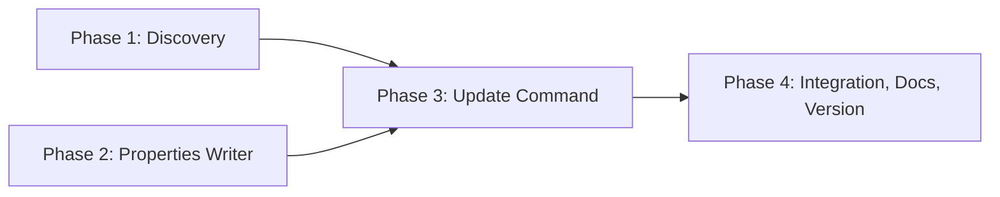
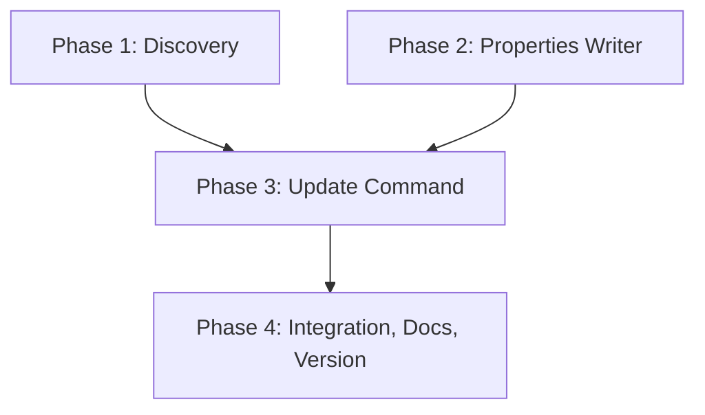

# Implementation Plan: Update Command For Saved Connections

## Overview

Four phases: a discovery probe that settles Q2, a Python properties writer, the `update` command, then integration tests, docs and version. The password goes through the existing `save_connection`; name, user and connect string go through the new writer.

## Affected Files

| File | Change Type | Description |
| ---- | ----------- | ----------- |
| src/sqlcl_conn_mng/properties.py | Update | Add `format_properties` |
| src/sqlcl_conn_mng/store.py | Update | Add `update_properties`; docstrings no longer say read-only |
| src/sqlcl_conn_mng/cli.py | Update | Add `update` parser and `_cmd_update`; generalize password reading |
| tests/test_properties.py | Update | Writer tests |
| tests/test_store.py | Update | `update_properties` tests |
| tests/test_cli.py | Update | `update` tests |
| tests/integration/test_update_compat.py | Create | Real-SQLcl scenarios |
| README.md | Update | Command table, notes, examples, store-format and intro statements |
| .claude/skills/sqlcl-conn-mng/SKILL.md | Update | List `update` |
| pyproject.toml | Update | Version 0.4.0 |
| uv.lock | Update | Lock refresh |
| docs/tasks/update_connection/open_questions.md | Update | Record the Q2 answer |

## Phase 1: Discovery Of SQLcl Replace Behavior

Requirements: REQ-4

Non-shippable: the probe is a throwaway script run against a temporary store; nothing from it is committed except the recorded answer.

### Implementation Work (Phase 1)

- Using the integration harness helpers (`tests/integration/harness.py`) in a temporary store, save a connection, then run `connect -save NAME -replace -savepwd` with a different user and with a different connect string.
- Record: whether `userName` and `connectionString` in `dbtools.properties` change; whether the id, key order and `folders.json` placement stay; the outcome of a connect that fails (wrong password) over an existing connection.
- Write the observations into `open_questions.md`, Q2, replacing the Q2 answer line.

### Test Work (Phase 1)

- None committed; the probe is the test.

### Verification (Phase 1)

- Q2 in `open_questions.md` carries the observed behavior and the command lines used, without any password. The Phase 3 step order is confirmed or rewritten from the answer: if `connect -replace` already writes the new user and URL, the file write for those two keys stays idempotent; if it does not, the file write is required.

## Phase 2: Properties Writer

Requirements: REQ-2

### Implementation Work (Phase 2)

- `properties.py`: `format_properties(props)` per `analysis.md`.
- `store.py`: `ConnectionStore.update_properties(conn_id, changes)` with atomic replace, comment and continuation-line refusal, UTF-8 and LF; update docstrings.

- `store.py`: when the changes hold a `connectionString`, convert an `ORACLE_BASIC` file to the `ORACLE_DATABASE` form SQLcl writes and refuse any other type (Q13, `solution_01.md`).

### Test Work (Phase 2)

- `tests/test_store.py` also covers the conversion, its key order, the untouched `--user` / `--new-name` cases and the refused type.
- `tests/test_properties.py`: escaping cases (backslash, `:` `=` `#` `!`, leading space, control characters, non-ASCII) and `parse(format(p)) == p`.
- `tests/test_store.py`: untouched keys, order, wallet and `folders.json` bytes; no temp file left; missing file; comment line refused.

### Verification (Phase 2)

- `make unit PYTEST_ARGS="tests/test_properties.py tests/test_store.py"`; `make check`.

## Phase 3: Update Command

Requirements: REQ-1, REQ-2, REQ-3, REQ-4, REQ-5

Conditional on Phase 1: the order "password step first, file write second" and the idempotence of the file write hold if Q2 shows `connect -replace` keeps the old properties or rewrites them to the new values; if Q2 shows a different effect, this phase is rewritten before it starts.

### Implementation Work (Phase 3)

- `cli.py`: `update` subparser with `--name` (required), `--new-name`, `--user`, `--connect-string`, a mutually exclusive `--password-env` / `--prompt-password`, `--no-save-password`; `set_defaults(func=_cmd_update)`.
- `_cmd_update`: option checks, lookup, duplicate-record refusal, value validation, case-insensitive new-name check, password step via `sq.save_connection(..., replace=True)`, then `store.update_properties`; print one result line.
- Generalize `_read_password` so `--prompt-password` and `--password-env` work for `update` without changing `add`.
- Partial-failure error text when the file write fails after the password step.

### Test Work (Phase 3)

- `tests/test_cli.py`: AC-1, AC-2, AC-11, AC-4 (fake runner arguments), AC-5, AC-6, AC-7, AC-8 with a fake runner and a temporary store.

### Verification (Phase 3)

- `make unit PYTEST_ARGS=tests/test_cli.py`; `make check`.

## Phase 4: Integration, Docs And Version

Requirements: REQ-2, REQ-3, REQ-6, REQ-7

### Implementation Work (Phase 4)

- `tests/integration/test_update_compat.py`: Python-edited name, user and connect string read back by `connmgr show` and `list`, on a connection SQLcl saved and on one imported from SQL Developer; password change keeps the id and follows `--no-save-password`.
- `README.md`: command table rows, notes, example, intro and store-format statements, stale-password caveat. `SKILL.md`: add `update`.
- `pyproject.toml` to `0.4.0`, `uv lock`, `uv tool install --from . sqlcl-conn-mng --reinstall`, check `--version`.
- Remove the Phase 1 probe leftovers from the working tree if any were created.

### Test Work (Phase 4)

- As listed; saved-password scenarios skip without the database variables.

### Verification (Phase 4)

- `make check`, `make unit`, `make integration`, `markdownlint-cli2` on the changed Markdown files, `sqlcl-conn-mng --version` prints `0.4.0`.

## Traceability

| REQ | Phase | Acceptance Criteria |
| --- | ----- | ------------------- |
| REQ-1 | Phase 3 | AC-1 |
| REQ-2 | Phase 2, Phase 3, Phase 4 | AC-2, AC-3, AC-11 |
| REQ-3 | Phase 3, Phase 4 | AC-4, AC-5 |
| REQ-4 | Phase 1, Phase 3 | AC-6, AC-7 |
| REQ-5 | Phase 3 | AC-8 |
| REQ-6 | Phase 4 | AC-9 |
| REQ-7 | Phase 4 | AC-3, AC-10 |

## Dependency Graph

Phases 1 and 2 are independent and can run in parallel.

## Estimated Scope

| Phase | Source Files | Test Files | Effort |
| ----- | ------------ | ---------- | ------ |
| Phase 1 | 0 | 0 | Small |
| Phase 2 | 2 | 2 | Medium |
| Phase 3 | 1 | 1 | Medium |
| Phase 4 | 0 (docs, version) | 1 | Medium |
